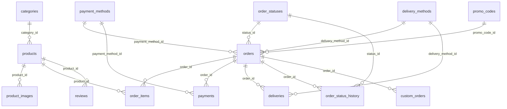

# Технический паспорт проекта PaprekolyX

| | |
|---|---|
| **Версия** | 1.2 |
| **Дата** | 18.09.2026 |
| **Тип** | Витрина handmade-изделий из эпоксидной смолы и фетра |
| **Владелец** | Albert23NO@ya.ru, +7 (925) 052-19-XX |
| **Сообщество ВК** | https://vk.ru/paprekolyx |
| **Сайт** | https://paprekolyx.github.io/PaprekolyX/ |
| **Репозиторий** | https://github.com/paprekolyx/PaprekolyX |

---

## 1. О проекте

PaprekolyX — авторская мастерская. Сайт работает как витрина с корзиной и формой заказа.
Основная коммуникация с клиентом идёт через сообщения сообщества ВКонтакте: мастер
подтверждает детали, принимает оплату и договаривается о доставке.

**Оплата:** VK Pay, перевод на карту (Сбербанк МИР, Яндекс Банк МИР), СБП.
**Доставка:** самовывоз (м. Ховрино), по Москве до станции метро, Boxberry и СДЭК по России.

**Особенности бизнес-логики:**

- На кастомные изделия действует предоплата 40%, невозвратная.
- Каждое изделие существует в одном экземпляре: эпоксидная смола даёт неповторимый рисунок.
- Возможна кастомизация цвета, формы и наполнения.

---

## 2. Стек технологий

| Слой | Технология | Комментарий |
|---|---|---|
| Разметка | HTML5 | одна страница, `index.html` |
| Стили | CSS3 + Tailwind CSS | Tailwind подключается через CDN |
| Логика | JavaScript ES6+ | без сборки, прямо в странице |
| Шрифты | Cormorant Garamond, Inter | через Fontsource CDN |
| База данных | Supabase (PostgreSQL) | таблицы, политики RLS, серверные функции |
| Клиент БД | `@supabase/supabase-js` v2 | через CDN |
| Хостинг | GitHub Pages | публикация через GitHub Actions |
| Хранение фото | Cloudinary или Supabase Storage | на 18.09.2026 фото по ссылкам из ВК |

**Чего в проекте нет и не планируется:** Node.js, Docker, Prisma, Redis, Nginx.
Ранее эти технологии были указаны в паспорте ошибочно — проект статический,
серверный код выполняется внутри Supabase (SQL-функции).

---

## 3. Архитектура

```
        Посетитель сайта
               │
               ▼
   ┌───────────────────────┐
   │  GitHub Pages         │  index.html (статика)
   └───────────┬───────────┘
               │ HTTPS, публичный ключ Supabase
               ▼
   ┌───────────────────────────────────────────┐
   │  Supabase                                 │
   │  ├─ PostgREST  — чтение каталога, текстов │
   │  ├─ RLS        — кто и что может          │
   │  └─ create_order() — приём заказов        │
   └───────────────────────────────────────────┘
               │
               ▼
        Сообщество ВКонтакте  — переписка, оплата, договорённости
```

**Ключевое решение:** заказ создаётся не прямым `INSERT` из браузера, а вызовом
серверной функции `create_order()`. Функция сама берёт цены из таблицы `products`,
поэтому подменить стоимость через консоль браузера нельзя.

**Cloudflare Worker для прокси к VK API** в текущей версии не используется:
товары хранятся в Supabase, а не подтягиваются из ВК. Решение сохраняется как
возможное на случай автоматической синхронизации с витриной сообщества.

---

## 4. Структура базы данных

Все таблицы — PostgreSQL в проекте Supabase `wanawtemywrlpnsvwvvh`.
Схема на 18.09.2026: **15 таблиц, 113 полей, 16 связей**.

### 4.0. Схема связей


> Диаграмма выше отображается на GitHub. Там, где Mermaid не поддерживается,
> связи перечислены таблицей ниже.

### 4.0.1. Связи между таблицами

| Родитель | Потомок | Поле связи | Удаление |
|---|---|---|---|
| `categories` | `products` | `category_id` | запрещено, пока есть ссылки |
| `products` | `product_images` | `product_id` | каскадное |
| `products` | `order_items` | `product_id` | запрещено, пока есть ссылки |
| `products` | `reviews` | `product_id` | каскадное |
| `orders` | `order_items` | `order_id` | каскадное |
| `orders` | `payments` | `order_id` | каскадное |
| `orders` | `deliveries` | `order_id` | каскадное |
| `orders` | `order_status_history` | `order_id` | каскадное |
| `orders` | `custom_orders` | `order_id` | каскадное |
| `order_statuses` | `orders` | `status_id` | запрещено, пока есть ссылки |
| `order_statuses` | `order_status_history` | `status_id` | запрещено, пока есть ссылки |
| `payment_methods` | `orders` | `payment_method_id` | запрещено, пока есть ссылки |
| `payment_methods` | `payments` | `payment_method_id` | запрещено, пока есть ссылки |
| `delivery_methods` | `orders` | `delivery_method_id` | запрещено, пока есть ссылки |
| `delivery_methods` | `deliveries` | `delivery_method_id` | запрещено, пока есть ссылки |
| `promo_codes` | `orders` | `promo_code_id` | запрещено, пока есть ссылки |

### Обозначения ключей

| Ключ | Значение |
|---|---|
| `PK` | PRIMARY KEY — первичный ключ |
| `FK` | FOREIGN KEY — ссылка на другую таблицу |
| `UK` | UNIQUE — значение не может повторяться |
| `NN` | NOT NULL — поле обязательно |
| `CHK` | CHECK — значение ограничено условием |
| `уст.` | устаревшее поле, не используется |

---

### 4.1. `categories` — Категории каталога

| Поле | Тип | Ключ | Описание |
|---|---|:--:|---|
| `id` | `serial` | **`PK`** | — |
| `slug` | `text` | **`UK`** | runy, broshi, podveski — для адресов |
| `name` | `text` |  | Руны, Брелоки, Подвески |
| `description` | `text` |  | — |

### 4.2. `products` — Товары

| Поле | Тип | Ключ | Описание |
|---|---|:--:|---|
| `id` | `serial` | **`PK`** | — |
| `article` | `text` | **`UK`** | внутренний артикул: 00099, 30001 |
| `name` | `text` |  | — |
| `price` | `numeric(10,2)` |  | в рублях |
| `category_id` | `int` | **`FK`** | → categories.id |
| `description` | `text` |  | — |
| `image_url` | `text` |  | главное фото; пусто — показывается заглушка |
| `is_active` | `boolean` |  | false — товар скрыт с сайта, но история заказов цела |
| `created_at` | `timestamptz` |  | по умолчанию now() |

### 4.3. `product_images` — Галерея товара

| Поле | Тип | Ключ | Описание |
|---|---|:--:|---|
| `id` | `serial` | **`PK`** | — |
| `product_id` | `int` | **`FK`** | → products.id, cascade |
| `image_url` | `text` | **`NN`** | — |
| `sort_order` | `int` |  | порядок в галерее |
| `is_main` | `boolean` |  | — |
| `alt_text` | `text` |  | для скринридеров и поиска |

### 4.4. `site_content` — Тексты и картинки сайта

| Поле | Тип | Ключ | Описание |
|---|---|:--:|---|
| `id` | `serial` | **`PK`** | — |
| `key` | `text` | **`UK`** | hero.subtitle, contacts.email, brand.logo_url |
| `value` | `text` |  | пусто для картинки — показывается заглушка |
| `description` | `text` |  | подсказка: где это видно на сайте |
| `updated_at` | `timestamptz` |  | обновляется триггером |

### 4.5. `order_statuses` — Справочник статусов

| Поле | Тип | Ключ | Описание |
|---|---|:--:|---|
| `id` | `serial` | **`PK`** | — |
| `code` | `text` | **`UK`** | new, paid, shipped, delivered |
| `name` | `text` |  | Новый, Оплачен, Отправлен |
| `description` | `text` |  | — |
| `is_final` | `boolean` |  | завершающий статус |
| `sort_order` | `int` |  | порядок в воронке |

### 4.6. `orders` — Заказы

| Поле | Тип | Ключ | Описание |
|---|---|:--:|---|
| `id` | `serial` | **`PK`** | номер заказа, который видит клиент |
| `created_at` | `timestamptz` |  | по умолчанию now() |
| `customer_name` | `text` |  | — |
| `customer_phone` | `text` |  | — |
| `customer_vk` | `text` |  | ссылка на профиль |
| `customer_email` | `text` |  | — |
| `status_id` | `int` | **`FK`** | → order_statuses.id |
| `payment_method_id` | `int` | **`FK`** | → payment_methods.id |
| `delivery_method_id` | `int` | **`FK`** | → delivery_methods.id |
| `total` | `numeric(10,2)` |  | сумма изделий, без доставки |
| `delivery_cost` | `numeric(10,2)` |  | — |
| `comment` | `text` |  | пожелания клиента |
| `promo_code_id` | `int` | **`FK`** | → promo_codes.id, может быть пустым |
| `status` | `text` | **`уст.`** | старое текстовое поле; не используется, подлежит удалению |

### 4.7. `order_items` — Позиции заказа

| Поле | Тип | Ключ | Описание |
|---|---|:--:|---|
| `id` | `serial` | **`PK`** | — |
| `order_id` | `int` | **`FK`** | → orders.id, cascade |
| `product_id` | `int` | **`FK`** | → products.id |
| `quantity` | `int` |  | — |
| `price` | `numeric(10,2)` |  | снапшот цены на момент заказа |

### 4.8. `order_status_history` — Журнал смены статусов

| Поле | Тип | Ключ | Описание |
|---|---|:--:|---|
| `id` | `serial` | **`PK`** | — |
| `order_id` | `int` | **`FK`** | → orders.id, cascade |
| `status_id` | `int` | **`FK`** | → order_statuses.id |
| `changed_at` | `timestamptz` |  | — |
| `changed_by` | `text` |  | admin / customer / system |
| `comment` | `text` |  | — |

### 4.9. `payment_methods` — Способы оплаты

| Поле | Тип | Ключ | Описание |
|---|---|:--:|---|
| `id` | `serial` | **`PK`** | — |
| `code` | `text` | **`UK`** | vk_pay, sber, yandex, sbp |
| `name` | `text` |  | — |
| `description` | `text` |  | — |
| `is_active` | `boolean` |  | неактивные не видны на сайте |

### 4.10. `payments` — Платежи

| Поле | Тип | Ключ | Описание |
|---|---|:--:|---|
| `id` | `serial` | **`PK`** | — |
| `order_id` | `int` | **`FK`** | → orders.id, cascade |
| `payment_method_id` | `int` | **`FK`** | → payment_methods.id |
| `amount` | `numeric(10,2)` |  | — |
| `paid_at` | `timestamptz` |  | — |
| `payment_type` | `text` |  | prepayment / full / topup |
| `transaction_id` | `text` |  | внешний идентификатор |
| `status` | `text` |  | по умолчанию success |

### 4.11. `delivery_methods` — Способы доставки

| Поле | Тип | Ключ | Описание |
|---|---|:--:|---|
| `id` | `serial` | **`PK`** | — |
| `code` | `text` | **`UK`** | pickup, metro_msk, boxberry, cdek |
| `name` | `text` |  | — |
| `description` | `text` |  | — |
| `base_price` | `numeric(10,2)` |  | 0 — стоимость уточняется |
| `is_active` | `boolean` |  | — |

### 4.12. `deliveries` — Доставки

| Поле | Тип | Ключ | Описание |
|---|---|:--:|---|
| `id` | `serial` | **`PK`** | — |
| `order_id` | `int` | **`FK`** | → orders.id, cascade |
| `delivery_method_id` | `int` | **`FK`** | → delivery_methods.id |
| `tracking_number` | `text` |  | — |
| `pickup_point` | `text` |  | адрес ПВЗ или станция метро |
| `cost` | `numeric(10,2)` |  | — |
| `shipped_at` | `timestamptz` |  | — |
| `delivered_at` | `timestamptz` |  | — |
| `comment` | `text` |  | — |

### 4.13. `promo_codes` — Промокоды

| Поле | Тип | Ключ | Описание |
|---|---|:--:|---|
| `id` | `serial` | **`PK`** | — |
| `code` | `text` | **`UK`** | — |
| `discount_type` | `text` |  | percent / fixed |
| `discount_value` | `numeric(10,2)` |  | — |
| `min_order_amount` | `numeric(10,2)` |  | — |
| `valid_from` | `date` |  | — |
| `valid_until` | `date` |  | — |
| `usage_limit` | `int` |  | пусто — без лимита |
| `used_count` | `int` |  | — |
| `is_active` | `boolean` |  | — |

### 4.14. `custom_orders` — Кастомные заказы

| Поле | Тип | Ключ | Описание |
|---|---|:--:|---|
| `id` | `serial` | **`PK`** | — |
| `order_id` | `int` | **`FK`** | → orders.id, cascade |
| `customer_name` | `text` |  | — |
| `customer_vk` | `text` |  | — |
| `description` | `text` | **`NN`** | пожелания клиента |
| `color_preference` | `text` |  | — |
| `shape_preference` | `text` |  | — |
| `filling_preference` | `text` |  | сухоцветы, пигменты, вставки |
| `reference_images` | `text` |  | JSON-массив ссылок |
| `prepayment_amount` | `numeric(10,2)` |  | 40% от стоимости |
| `prepayment_paid` | `boolean` |  | — |
| `estimated_days` | `int` |  | — |
| `status` | `text` |  | pending / in_progress / ready / done |

### 4.15. `reviews` — Отзывы

| Поле | Тип | Ключ | Описание |
|---|---|:--:|---|
| `id` | `serial` | **`PK`** | — |
| `product_id` | `int` | **`FK`** | → products.id, cascade |
| `customer_name` | `text` |  | — |
| `rating` | `int` | **`CHK`** | от 1 до 5 |
| `comment` | `text` |  | — |
| `created_at` | `timestamptz` |  | — |
| `is_published` | `boolean` |  | модерация; политика RLS не даёт опубликовать в обход |

---

## 5. Пользовательские пути

| № | Путь | Как работает сейчас |
|---|---|---|
| 1 | **Просмотр каталога** | Главная → секция «Коллекция». Товары и категории читаются из Supabase. На кнопках категорий показано количество изделий. |
| 2 | **Фильтрация** | Клик по категории — фильтрация уже загруженного списка, без повторного запроса. |
| 3 | **Добавление в корзину** | Кнопка «В корзину» → счётчик в шапке → всплывающее уведомление. Корзина хранится в `localStorage` и переживает обновление страницы. |
| 4 | **Управление корзиной** | Иконка корзины → боковая панель → изменение количества, удаление позиции, пересчёт суммы. |
| 5 | **Оформление заказа** | Кнопка «Оформить заказ» → модальная форма → вызов `create_order()` → записи в `orders`, `order_items`, `deliveries`, `order_status_history` → экран с номером заказа → переход в ВК. |
| 6 | **Кастомный заказ** | Кнопка «Обсудить в ВК» → переписка с мастером → предоплата 40% → изготовление → доплата → отправка. Запись в `custom_orders` пока вносится мастером вручную. |
| 7 | **Связь** | Секция «Контакты»: ВКонтакте, e-mail, телефон. Значения берутся из таблицы `site_content`. |
| 8 | **Смена темы** | Переключатель в шапке → светлая или тёмная тема → выбор сохраняется в браузере. |
| 9 | **Документы** | Футер → «Технический паспорт» и «Брендбук» — модальные окна. |

---

## 6. Внешние сервисы и ключи

| Сервис | Назначение | Где хранить ключ |
|---|---|---|
| Supabase | База данных, RLS, серверные функции | Публичный ключ `sb_publishable_…` — в `index.html`, это безопасно. Секретный `sb_secret_…` — **нигде в репозитории** |
| ВКонтакте | Переписка с клиентом, оплата | Токен сообщества — только на сервере (в проекте пока не используется) |
| Cloudinary | Хранение и обработка фото | `api_secret` — только на сервере; `cloud_name` — можно в браузере |
| GitHub Pages | Хостинг | — |

**Правило:** публичный ключ Supabase сам по себе ничего не разрешает — доступ
ограничивают политики RLS. Без включённого RLS база открыта всем.

---

## 7. Безопасность

### 7.1. Row Level Security

RLS включён на всех таблицах. Действующий набор политик:

| Таблица | Чтение (anon) | Запись (anon) |
|---|---|---|
| `categories`, `products`, `order_statuses`, `product_images`, `site_content` | всё | закрыто |
| `payment_methods`, `delivery_methods` | только `is_active = true` | закрыто |
| `reviews` | только `is_published = true` | добавление, всегда неопубликованным и с рейтингом 1–5 |
| `orders`, `order_items`, `payments`, `deliveries`, `custom_orders`, `order_status_history` | закрыто | закрыто (заказ — только через функцию) |
| `promo_codes` | **закрыто полностью** | закрыто |

**Отступление от редакции 1.1:** промокоды были заявлены как «SELECT всем».
При публичном чтении любой посетитель увидел бы все действующие коды в консоли
браузера. Проверка промокода будет выполняться серверной функцией, которая
возвращает только факт применения скидки.

### 7.2. Функция `create_order`

| Защита | Как реализовано |
|---|---|
| Подмена цены | Цены берутся из `products`, присланные клиентом игнорируются |
| Частичная запись | Всё в одной транзакции: заказ, позиции, доставка, история статусов |
| Заказ несуществующего или снятого с продажи товара | Проверяется `is_active = true` |
| Некорректные данные | Имя обязательно, нужен хотя бы один способ связи, количество 1–99, не более 50 позиций |
| Спам и двойной клик | Не более 3 заказов за 10 минут с одного телефона, ВК или e-mail |
| Раскрытие чужих заказов | Функция возвращает только номер и суммы, `SELECT` для anon закрыт |

### 7.3. Клиентская сторона

- Все тексты, приходящие из базы и вводимые пользователем, экранируются перед выводом
  (защита от XSS).
- Повторная отправка формы блокируется на время запроса.
- Секретные ключи в браузерный код не попадают.

---

## 8. Управление контентом через `site_content`

Тексты и картинки, которые могут часто меняться, вынесены из HTML в таблицу
`site_content`. Правка выполняется в **Supabase → Table Editor → site_content**
и не требует изменения кода и публикации сайта.

**Как это связано с HTML:** у элемента стоит атрибут с именем ключа.

| Атрибут | Что подставляет | Пример |
|---|---|---|
| `data-content="ключ"` | текст элемента | `<span data-content="brand.tagline">…</span>` |
| `data-content-src="ключ"` | адрес картинки | `` |
| `data-content-href="ключ"` | адрес ссылки | `<a data-content-href="contacts.vk_url">` |

**Отказоустойчивость:** текст внутри тега остаётся как запасной. Если база недоступна
или ключ не заполнен, посетитель видит значения из HTML — пустых мест не появляется.

**Группы ключей:** `brand.*` (название, подпись, логотип), `hero.*` (первый экран),
`about.*` (о мастерской), `order.*` (условия, цены доставки, предоплата),
`contacts.*` (ВКонтакте, e-mail, телефон), `footer.*` (описание, версия, копирайт).

> **Внимание:** `contacts.phone_display` и `contacts.phone_href` должны совпадать.
> Сейчас на сайте показан номер `+7 (925) 052-19-XX`, а по клику набирается
> `+79250521900`. Расхождение нужно устранить.

---

## 9. Темы оформления

Поддерживаются тёмная (основная) и светлая темы. Переключатель — в шапке сайта.

| | Тёмная | Светлая |
|---|---|---|
| Фон страницы | `#0A0A0F` | `#FAF7FC` |
| Фон секций | `#12101A` | `#FFFFFF` |
| Фон карточек | `#1A1525` | `#FFFFFF` |
| Акцент | `#FF2D95` (5.70:1) | `#D6006E` (5.14:1) |
| Дополнительный акцент | `#A855F7` (4.99:1) | `#7C3AED` (5.70:1) |
| Текст | `#F0E6FF` (16.43:1) | `#1C1424` (17.87:1) |
| Второстепенный текст | `#8A7A9A` (5.01:1) | `#6B5F7A` (5.93:1) |
| Неоновое свечение | включено | отключено |

В скобках — коэффициент контраста к фону по WCAG 2.1. Норма для обычного текста 4.5:1
выполнена во всех парах.

Акцент в светлой теме намеренно темнее: фирменный `#FF2D95` на белом даёт 3.46:1,
что ниже нормы. Подробности, правила и спецификация переключателя — в брендбуке,
раздел «Темы оформления».

**Поведение:** выбор сохраняется в `localStorage` под ключом `paprekolyx_theme`;
при первом визите тема определяется по настройке операционной системы
(`prefers-color-scheme`); тема применяется до отрисовки страницы, поэтому
«вспышки» другого цвета при загрузке нет. Заглушки товаров перерисовываются под
текущую тему; настоящие фотографии не затрагиваются.

---

## 10. Что сделано

- Сайт-витрина: каталог, корзина, форма заказа, модальные окна документов.
- Дизайн в стиле неон; две темы оформления с переключателем.
- Развёрнут Supabase, созданы 15 таблиц.
- Загружены 7 категорий и 69 товаров.
- Настроены политики RLS на чтение и на приём заказов.
- Схема `orders` и `order_items` доведена до паспорта, создана `product_images`.
- Заполнены справочники: 9 статусов заказа, 4 способа оплаты, 4 способа доставки.
- Серверная функция `create_order()` — заказы пишутся в базу.
- Тексты и картинки сайта вынесены в таблицу `site_content`.
- Число изделий и категорий на первом экране считается из базы.
- На кнопках категорий показано количество товаров.
- Корзина сохраняется в браузере.
- Настроена автопубликация на GitHub Pages.
- Автоматические тесты: SQL проверяется на реальном PostgreSQL, интерфейс — в jsdom.

---

## 11. Что осталось сделать

| Приоритет | Задача |
|---|---|
| Высокий | Перенести фото из ВК в Cloudinary, заполнить `product_images`, уменьшить вес |
| Высокий | Устранить расхождение показанного и набираемого номера телефона |
| Высокий | Удалить устаревшее поле `orders.status` после перехода на `status_id` |
| Средний | Промокоды: серверная функция проверки без публичного чтения таблицы |
| Средний | Отзывы на сайте с модерацией |
| Средний | Админ-панель или SQL-представление для работы с заказами |
| Средний | Форма кастомного заказа с записью в `custom_orders` и расчётом предоплаты 40% |
| Низкий | Авторизация через ВК и таблица `cart_items` для истории заказов клиента |
| Низкий | Cloudflare Worker для синхронизации товаров с витриной сообщества |
| Низкий | Разнести `index.html` на отдельные файлы стилей и скриптов |

---

## 12. История версий

| Версия | Дата | Что изменилось |
|---|---|---|
| 1.0 | 17.09.2026 | Первая редакция |
| 1.1 | 18.09.2026 | Уточнены стек, хранение, пользовательские пути |
| **1.2** | **18.09.2026** | Схема приведена к фактической (15 таблиц); добавлены `product_images` и `site_content`; описание таблиц переведено в табличный вид со связями; добавлены разделы о безопасности, `create_order`, управлении контентом и темах оформления; стек очищен от технологий, которых в проекте нет; пользовательские пути приведены в соответствие с работающим сайтом |

---

## 13. Контакты проекта

- **E-mail:** Albert23NO@ya.ru
- **Телефон:** +7 (925) 052-19-XX
- **ВКонтакте:** https://vk.ru/paprekolyx
